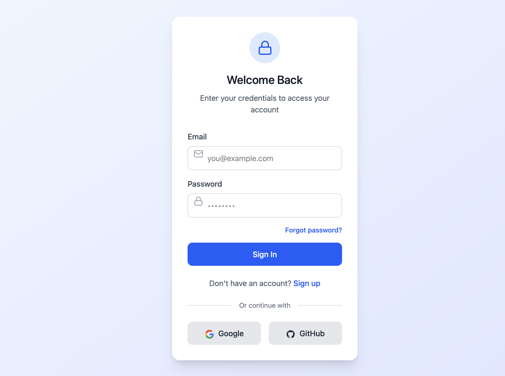
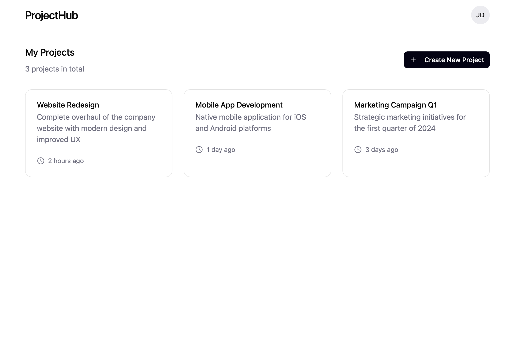
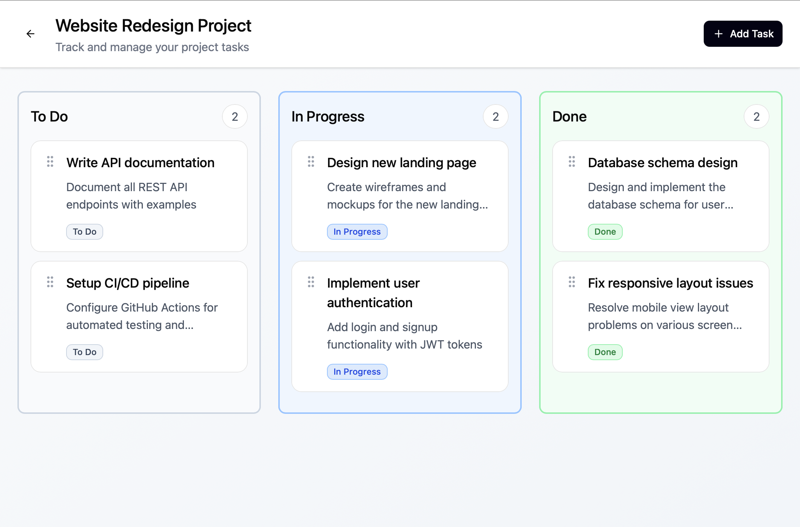

# 05 – UI Flow

Purpose: Define the main frontend screens and user navigation.

---

## Pages

- Login / Register
- Project Dashboard
- Project Board (Kanban)

---

## Navigation Flow

Login / Register  
→ Project Dashboard  
→ Project Board  
→ Back to Dashboard  
→ Logout

---

## UI Reference

The detailed UI design and interactions are documented in Figma:

Screenshots include:
- Authentication (Login / Register)
- Project Dashboard (Project list)
- Project Board (Kanban view)

---

## Notes

- Users must be authenticated to access all pages except Login/Register
